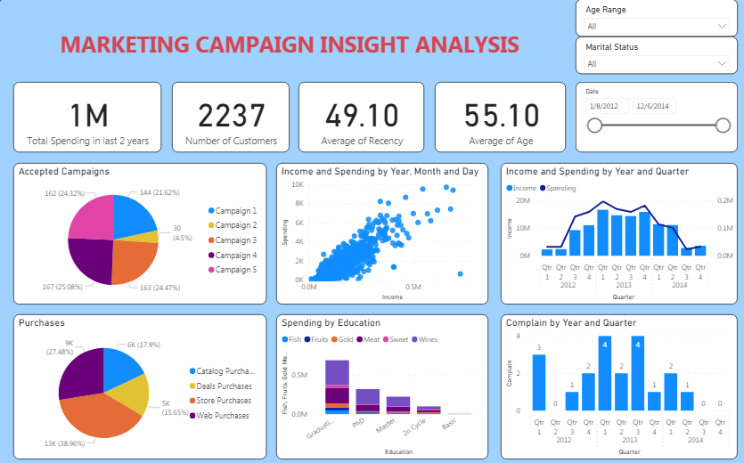
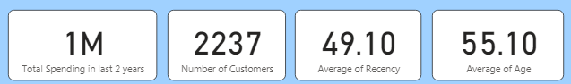
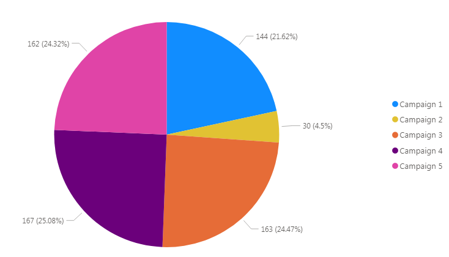
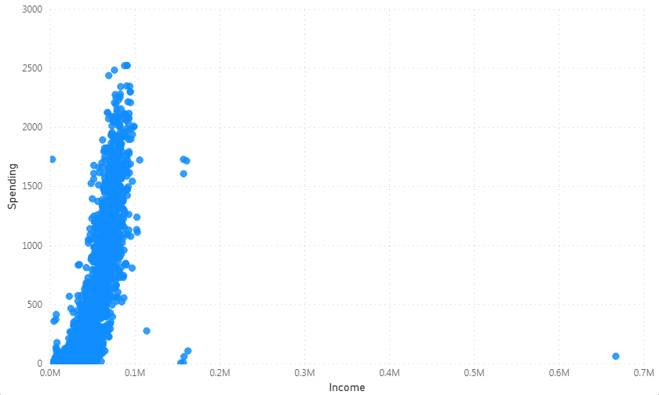
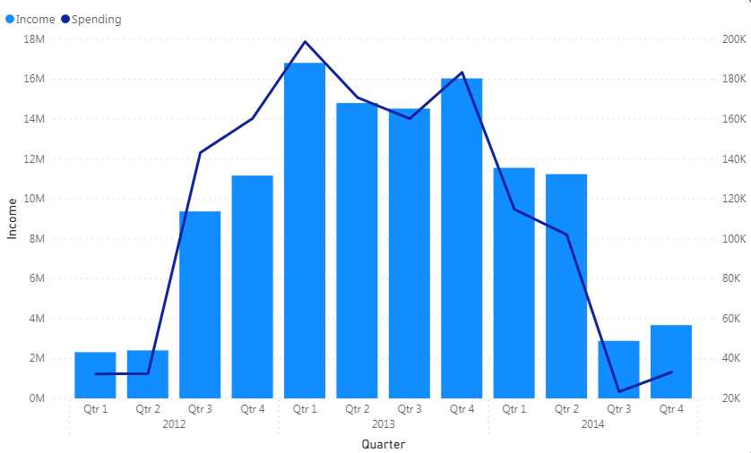
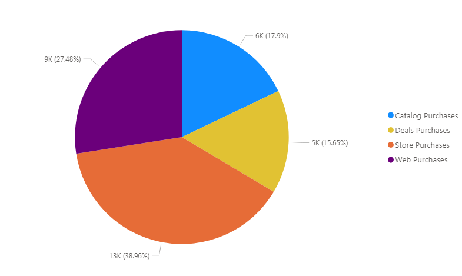
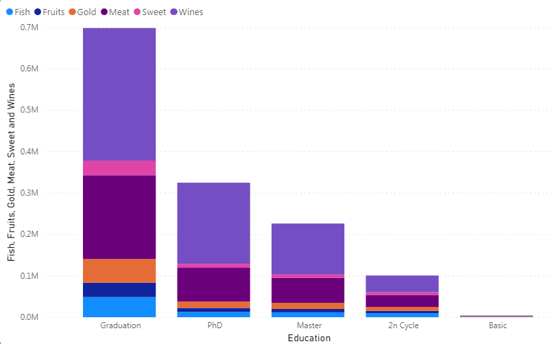
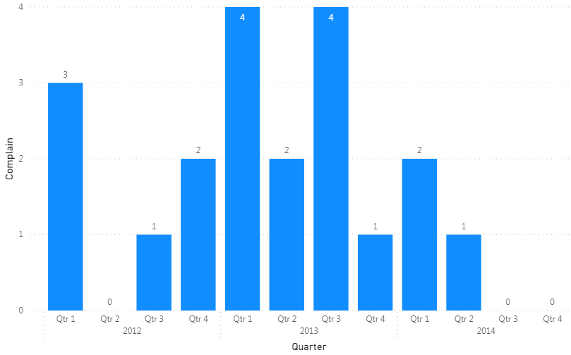

# Marketing-Campaign-Insight-Analysis

## 1. Introduction
The Marketing Campaign Insight Analysis Dashboard, built in Power BI using data from marketing_campaign.csv file, provides a clear, centralized view of campaign results. This dashboard helps business what works, make smarter marketing decisions and boost their marketing ROI.
## 2. Data Description
Before analyzing, please read the data description below:

Attributes

**People**
- ID: Customer's unique identifier
- Year_Birth: Customer's birth year
- Education: Customer's education level
- Marital_Status: Customer's marital status
- Income: Customer's yearly household income
- Kidhome: Number of children in customer's household
- Teenhome: Number of teenagers in customer's household
- Dt_Customer: Date of customer's enrollment with the company
- Recency: Number of days since customer's last purchase
- Complain: 1 if the customer complained in the last 2 years, 0 otherwise
  
**Products**
  
- MntWines: Amount spent on wine in last 2 years
- MntFruits: Amount spent on fruits in last 2 years
- MntMeatProducts: Amount spent on meat in last 2 years
- MntFishProducts: Amount spent on fish in last 2 years
- MntSweetProducts: Amount spent on sweets in last 2 years
- MntGoldProds: Amount spent on gold in last 2 years
  
**Promotion**
  
- NumDealsPurchases: Number of purchases made with a discount
- AcceptedCmp1: 1 if customer accepted the offer in the 1st campaign, 0 otherwise
- AcceptedCmp2: 1 if customer accepted the offer in the 2nd campaign, 0 otherwise
- AcceptedCmp3: 1 if customer accepted the offer in the 3rd campaign, 0 otherwise
- AcceptedCmp4: 1 if customer accepted the offer in the 4th campaign, 0 otherwise
- AcceptedCmp5: 1 if customer accepted the offer in the 5th campaign, 0 otherwise
- Response: 1 if customer accepted the offer in the last campaign, 0 otherwise
  
**Place**

- NumWebPurchases: Number of purchases made through the company’s website
- NumCatalogPurchases: Number of purchases made using a catalogue
- NumStorePurchases: Number of purchases made directly in stores
- NumWebVisitsMonth: Number of visits to company’s website in the last month

## 3. Insights & Actionable Insights
### Overall (Cards)

- Total Spending: **1 Million**
  - Total spending of all customers in last 2 years
  - Significant spend => it is promising for further optimization or expansion
- Number of Customers: **2237**
  - Large enough sample size for analysis
- Average of Recency: **49.10**
  - Average number of days since the last purchase of customers
  - Quite high => it means that customers have returned less recently
- Average of Age: **55.10**
  - Relatively older customer base => The business should choose appropriate messages, products

### Accepted Campaigns (Pie Chart)

- Insights:
  - Campaign 2 was clearly a failure, with significantly lower adoption rates (only **4.5%**, **30**)
  - Campaign 3,4 and 5 performed similarly and really well (over **24%**)
- Actionable Insights:
  - Using A/B Testing for Campaign 2 content with 2 versions: 1 version that re-uses the message from Campaign 3 (which is performing well), 1 version that adjusts the current content (e.g changes the offer, language, delivery channel...) => **Objective**: Evaluate whether ppor performance is due to content or timing/channel.
  - For Campaign 3,4 and 5, group of customers who accepted these campaigns, analyze common characteristics: age, income, marital status, number of purchases... From there, build effective target customer portraits for the following campaigns. Re-use content from these campaigns for customer groups with similar features => **Objective**: Increase ROI by targeting more precisely, leveraging proven effective content.

### Income and Spending by Customer (Scatter Plot)

- Insights:
  - The data distribution is scattered, not showing a clear linear relationship.
  - There are many low-income customers but high consumption => Opposite to expectations.
  - Some customers have high income but spend very little => Potential to stimulate spending.
  - The middle-income group (~50K–100K) is the group with the most stable spending level.
    
  => It is impossible to conclude that "Income increases, Spending increases", because each customer has different consumer behavior, not following a general trend.
- Actionable Insights:
  - Customer segmentation:
    - Low income - high spending group may be loyal customers or have strong needs => Should be prioritized for care.
    - High income - low spending group is untapped potential => Need appropriate promotion and upsell campaigns.
  - Deep Analysis: Add analysis by age, product type, region… to better understand why there is this difference in behavior.
    
### Income and Spending by Year and Quarter (Line and Column Chart)

- Insights:
  - Income and Spending increased sharply in 2013 and early 2014, then decreased.
  - Spending peaked in Q3 2013 and Q4 2013.
- Actionable Insights:
  - Recreate campaigns/sales processes similar to 2013–2014.
  - Investigate reasons for decline after 2014 (outdated campaigns or saturated market).

### Purchases (Pie Chart)

- Insights:
  - Web Purchase accounts for the highest proportion => Strong online trend.
  - Low store => Less customers come to the store.
- Actionable Insights:
  - Invest in online marketing, website promotion.
  - Re-evaluate sales strategy at physical stores.
 
### Spending by Education (Stack Column Chart)

- Insights:
  - Customers with Bachelor's & PhD degrees spend more.
  - "Basic" and "2nd Cycle" groups spend very little.
- Actionable Insights:
  - Target highly educated customers with premium products and more in-depth content.
  - Basic groups => Create incentive programs to increase engagement.

### Complain by Year and Quarter (Column Chart)

- Insights:
  - Combining the Line & Column Chart above, when Spending increased (2013), complaints also increased (especially Q1 and Q3 2013).
  - But complaints decreased sharply after Q4 2013, this is also the time when Spending started to trend down.
- Actionable Insights:
  - There are 2 reasons for the decrease in complaints since the beginning of 2014, which are:
    - If the service has been improved after 2014, re-apply that process to new campaigns.
    - If the decrease in complaints is due to a decrease in customers, it is necessary to re-evaluate the loyal customer experience.

